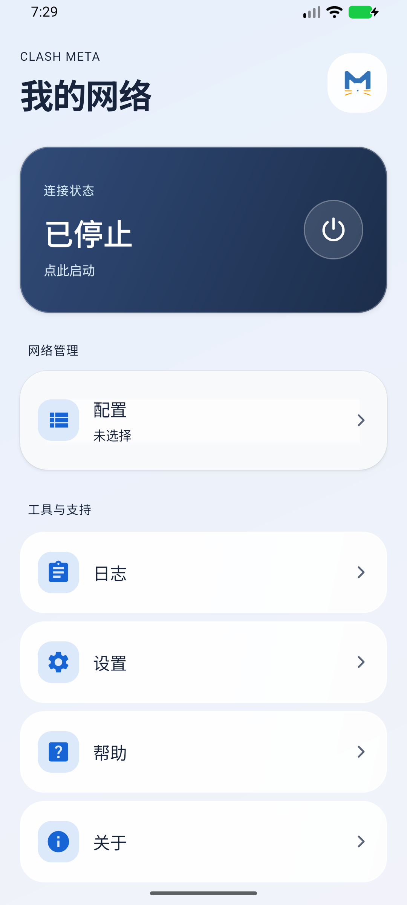
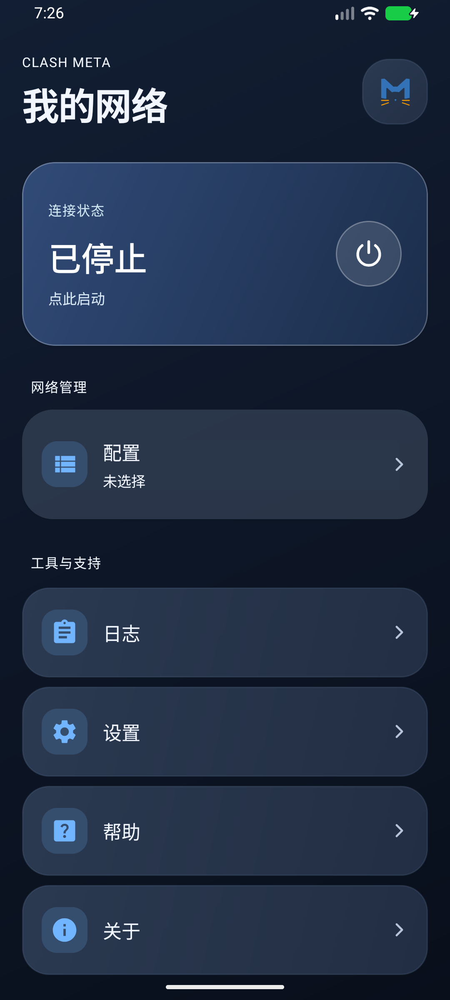

<p align="center">
  
</p>

<h1 align="center">Clash Meta Plus</h1>

<p align="center">
  基于 Clash Meta for Android 的独立 Android 网络代理客户端修改分支。
</p>

<p align="center">
  <a href="https://github.com/Roylyl/Clash-Meta-Plus/releases"></a>
  <a href="https://github.com/Roylyl/Clash-Meta-Plus/releases"></a>
  <a href="https://github.com/Roylyl/Clash-Meta-Plus/stargazers"></a>
  <a href="https://github.com/Roylyl/Clash-Meta-Plus/commits/main"></a>
  <a href="LICENSE"></a>
</p>

<p align="center">
  <a href="https://github.com/Roylyl/Clash-Meta-Plus/releases">下载与发布</a> ·
  <a href="#快速上手">快速上手</a> ·
  <a href="#界面预览">界面预览</a> ·
  <a href="#从源码构建">构建</a> ·
  <a href="CHANGELOG.md">修改记录</a>
</p>

> [!IMPORTANT]
> 本项目不是 MetaCubeX、Clash for Android 原作者或 Apple 的官方产品，与这些项目或公司无官方隶属、赞助或背书关系。原有源码、图标及第三方作品的版权归各自权利人所有。

## 项目概览

Clash Meta Plus 17.01 在 [Clash Meta for Android](https://github.com/MetaCubeX/ClashMetaForAndroid) 工程基础上调整后台连接策略、最近任务隐藏和原生界面，并于 2026-09-13 整理为本工程。项目使用 Mihomo 内核，要求用户自行提供合法、获授权的配置或订阅；仓库不提供节点、订阅、账户或网络接入服务。

整体派生程序继续按 [GNU GPL v3](LICENSE) 分发，独立第三方材料遵循各自许可。本分支的具体修改见 [CHANGELOG](CHANGELOG.md)，来源记录见 [UPSTREAM](docs/UPSTREAM.md)。GitHub Releases 中是否存在可直接安装的 APK，以发布页实际附件为准；仓库不把标签、CI artifact 或版本号等同于已发布安装包。

**增强后台保活 · 最近任务隐藏 · 浅色／深色主题 · Mihomo 内核**

### 导航

[核心功能](#核心功能) · [快速上手](#快速上手) · [界面预览](#界面预览) · [从源码构建](#从源码构建) · [外部自动化](#外部自动化) · [隐私安全与使用边界](#隐私安全与使用边界) · [许可与分发](#许可与分发)

| 项目 | 当前配置 |
| --- | --- |
| 应用版本 | `17.01`，`versionCode = 1701000` |
| 默认 Meta 包名 | `com.github.metacubex.clash.meta` |
| 最低系统 | Android 5.0 / API 21 |
| 编译／目标 SDK | API 35 |
| 已验证安装包 | `arm64-v8a` Meta Release |
| 源码支持架构 | `arm64-v8a`、`armeabi-v7a`、`x86`、`x86_64` |

## 核心功能

以下功能是 17.01 相对所接收上游源码的主要变化；完整范围与日期以 [CHANGELOG](CHANGELOG.md) 和 [修改文件清单](docs/MODIFIED_FILES.md) 为准。

### 增强后台保活

在 **设置 → 应用 → 增强后台保活** 中控制，默认开启，切换立即生效。

- 连接期间持有 CPU 部分唤醒锁，避免内核因熄屏进入原有的暂停策略；关闭开关后释放额外唤醒锁并恢复原策略。
- VPN 与代理服务使用 Android 的 `START_STICKY` 恢复机制，保留前台运行通知，移除最近任务卡片不会主动结束服务。
- 界面连接或重新连接后台进程时，如果仍有连接意图而运行实例缺失，会尝试恢复一次。
- 提供 **后台电池优化**（Android 6.0+）与 **始终开启 VPN**（Android 7.0+，VPN 模式）的系统设置入口，便于按需调整后台权限。

增强保活会增加耗电。恢复仍受 Android 与厂商后台管理约束，系统强制停止后不能承诺自动恢复。界面连接触发的补充恢复只覆盖界面可见或重新打开应用的情况；应用完全不可见时仍依赖系统恢复机制。主动停止连接会清除恢复意图。

**自动重启** 是另一个开关，默认关闭，控制开机或应用更新后是否尝试恢复此前要求保持运行的连接。它与增强后台保活分别设置。

### 从最近任务隐藏

在 **设置 → 应用 → 从最近任务隐藏** 中开启，立即隐藏最近任务／多任务界面中的应用卡片，**保留 VPN 连接与运行通知**。该开关默认关闭，切换无需重建页面。

此开关与 **隐藏应用图标** 分开设置；只隐藏最近任务卡片时，仍可从桌面图标打开应用。

### 界面更新

首页大标题、连接状态卡片、分组导航、圆角半透明表面和蓝绿状态色统一调整，并适配浅色／深色主题。设置页、工具栏、配置列表和代理卡片沿用同一套视觉样式。

界面通过 Android 原生布局与绘图资源实现圆角、半透明和分层视觉效果，未引入 Apple 的字体、图标库或专有界面组件。当前应用名称与猫形图标仍继承上游；关于和帮助页面已标明 Plus 为独立修改版本，并提供离线许可证及第三方声明。

## 快速上手

1. 安装适合设备架构的 APK；已验证的 Meta Release ARM64 构建面向 ARM64 设备。
2. 打开 **配置**，导入自己的配置文件或订阅地址，并选择要使用的配置。
3. 返回首页启动连接，首次使用 VPN 模式时完成系统授权。
4. 按需在 **设置 → 应用** 调整增强后台保活、后台电池优化和始终开启 VPN。
5. 需要隐藏多任务卡片时，开启 **从最近任务隐藏**。

应用需要你自行提供可用配置或订阅。导入链接只负责创建配置入口，是否连接成功取决于配置内容和网络环境。

**安装与签名：** 未配置正式签名的本地／CI 构建使用各自的 Android Debug 证书，不能直接视为上游官方签名包。Android 覆盖安装要求签名一致；若与已安装版本签名不同，请先导出原应用配置，再决定更换安装。版本号更高也不能绕过签名要求。自行发布时请使用自己的固定签名，配置见下方构建说明。

## 界面预览

下图为 17.01 在 Android 模拟器中的实际界面，分别展示浅色与深色主题；保留的上游名称与图标不代表上游背书。

| 浅色主题 | 深色主题 |
| --- | --- |
|  |  |

## 从源码构建

以下步骤默认构建 **Meta** 变体。Android Studio 默认可能选中 Alpha，请按需在 **Build Variants** 中将应用模块切换为 `metaDebug` 或 `metaRelease`。

### 1. 准备工具链

| 工具 | 本项目使用的版本 |
| --- | --- |
| JDK | **21**，本地验证版本为 Temurin 21.0.7 |
| Gradle | **8.10.2**，使用仓库中的 `gradlew` |
| Android Gradle Plugin | 8.8.0 |
| Kotlin | 2.1.0 |
| Android SDK | Platform 35 |
| Android NDK | `29.0.14206865` |
| CMake | 3.22.1（已验证版本） |
| Go | MetaCubeX Go 1.26 工具链，并应用项目的两份运行时补丁；本地验证为 1.26.7 |

Go 工具链来源与补丁流程参见 [.github/workflows/build.yaml](.github/workflows/build.yaml)。对新工具链应用 `.github/patch/` 下的两份补丁；已经应用过补丁的工具链不要重复修改。

**Gradle 8.10.2 不能使用 JDK 25 运行。** 请单独为项目选择 JDK 21，即使 Android Studio 自带的是较新 JBR。参见 [Gradle 8.10.2 兼容说明](https://docs.gradle.org/8.10.2/userguide/compatibility.html)。

### 2. 准备内核源码

本仓库将内核作为普通源码保存在 `core/src/foss/golang/clash`，克隆或解压完整源码后即可使用，**不需要初始化 Git 子模块**。内核固定于提交 `ac017cdd246ce8bd547653d927e7bf77d7ee73d5`。

原工程的子模块声明保存在 `docs/upstream/gitmodules.original` 供溯源，不参与当前构建。更新内核时应明确选择提交、保留其许可证与声明，并同步检查 Go 依赖及构建结果；不要把跟踪上游最新分支当作可复现构建。

### 3. 配置 SDK 与 Go

在项目根目录创建 `local.properties`，填写本机的真实路径：

```properties
sdk.dir=/path/to/android-sdk
go.dir=/path/to/patched-go
```

`go.dir` 指向含有 `bin/go` 的 Go 安装根目录。配置后，构建任务直接使用该可执行文件，并设置 `GOROOT` 与 `GOTOOLCHAIN=local`，避免 Android Studio 的环境缺少 Go，或自动切换到未打补丁的工具链。未设置 `go.dir` 时，保留原来从 `PATH` 查找 `go` 的方式。

`local.properties` 包含本机路径，不应提交到版本控制或复制给其他机器直接使用。

### 4. 选择 JDK 21

**Android Studio**

打开 **设置 → 构建、执行、部署 → 构建工具 → Gradle → Gradle JDK**，选择已安装的 JDK 21，然后执行 **Sync Project with Gradle Files**。

也可以选择 `GRADLE_LOCAL_JAVA_HOME`，在项目的 `.gradle/config.properties` 中填写：

```properties
java.home=/path/to/jdk-21
```

macOS 上应填写 JDK 的 `Contents/Home` 目录。配置方式见 [Android 官方 Gradle JDK 说明](https://developer.android.com/build/jdks#gradle-jdk)。

**命令行（macOS / Linux）**

```sh
export JAVA_HOME="/path/to/jdk-21"
export PATH="$JAVA_HOME/bin:$PATH"
./gradlew --version
```

确认 JVM 版本为 21。修改终端的 `JAVA_HOME` 不等于修改了 Android Studio 的 Gradle JDK，两处都需要正确配置。Windows 下使用 `gradlew.bat`，并设置相同的 JDK 与本地工具链路径。

### 5. 配置签名

本地试编译可跳过此步；没有 `signing.properties` 时，Release 构建回退到本机 Debug 签名。

需要自己的发布签名时，将密钥文件放在项目根目录，文件名为 **`release.keystore`**，并创建 `signing.properties`：

```properties
keystore.password=YOUR_STORE_PASSWORD
key.alias=YOUR_KEY_ALIAS
key.password=YOUR_KEY_PASSWORD
```

当前构建脚本固定读取根目录的 `release.keystore`，**不读取 `keystore.path`**。请保管好密钥与密码，后续覆盖更新需要继续使用同一签名。密钥文件和签名配置已由 `.gitignore` 排除。

### 6. 构建 APK

完整 Meta Release 构建，包含分架构与 Universal APK：

```sh
./gradlew :app:assembleMetaRelease
```

仅构建 ARM64，与本次交付一致：

```sh
./gradlew :app:assembleMetaRelease \
  -Pandroid.injected.build.abi=arm64-v8a \
  -Pandroid.injected.testOnly=false \
  --no-daemon --max-workers=4
```

构建任务会下载 Geo 数据。若 `app/src/main/assets/` 已包含 `geoip.metadb`、`geosite.dat`、`ASN.mmdb` 和 `BundleMRS.7z`，且希望复用这些文件，可在上述命令末尾加上 `-x :app:downloadGeoFiles`。执行 `:app:clean` 会删除该资源目录，之后需要重新下载。

常规产物位于 `app/build/outputs/apk/meta/release/`；使用 `android.injected.build.abi` 的本次验证构建，实际输出为：

```text
app/build/intermediates/apk/meta/release/cmfa-17.01-meta-arm64-v8a-release.apk
```

可用 `rg --files app/build -g '*.apk'` 查找实际生成的 APK。

<details>
<summary>可选：自定义包名与构建变体</summary>

在 `local.properties` 中添加：

```properties
custom.application.id=com.example.clash
remove.suffix=true
```

`custom.application.id` 替换基础包名；省略 `remove.suffix` 时，Meta / Alpha 变体分别追加 `.meta` / `.alpha`。设为 `true` 后直接使用基础包名。Debug 版本追加 `.debug` **版本名**后缀，不额外追加包名后缀。

Alpha 构建任务为 `:app:assembleAlphaRelease`。本文的安装包与外部自动化示例均使用默认 Meta 包名；自定义包名后需同步调整自动化配置。

</details>

## Git 与 CI

`.gitignore` 排除构建缓存、IDE 本地状态、SDK／Go 路径、签名密钥、私有环境配置、APK 和四个下载生成的 Geo 数据文件。Gradle Wrapper、Go 依赖清单、许可证、声明、公开 CA 文件及内核测试夹具仍应保留。不要用全局 `*.pem`、`*.json` 或 `*.yaml` 规则误删源码所需文件。

提交前按改动范围执行上文对应的构建与验证，并记录实际结果；Python 工具缓存、虚拟环境和 Go 编译出的测试程序也不提交。仓库卫生可独立检查，不需要重新构建 APK：

```sh
git status --short
git diff --check
git diff --cached --stat
# 不依赖个人全局忽略配置；应显示本仓库中的匹配规则。
git -c core.excludesFile=/dev/null check-ignore -v .gradle/check app/build/check scripts/__pycache__/package-source.pyc core/src/foss/golang/bridge.test
# 正常应无输出；如有匹配，先核实规则，不直接删除或取消跟踪文件。
git -c core.excludesFile=/dev/null ls-files --cached --ignored --exclude-standard
```

当前工作流仅允许手动触发，使用只读仓库权限，生成验证用 APK、源码归档、构建信息与校验值；不会自动发布 Release、创建标签或更新内核。旧上游工作流以 `.disabled` 文件保存在 `docs/upstream/`，不执行。CI 的临时 artifact 有保留期限，不能当作长期对应源码下载渠道。

正式分发前，应为每个二进制版本保留对应的源码版本与依赖来源，并将可用的本分支源码获取方式提供给接收者。当前 `origin` 指向 [Roylyl/Clash-Meta-Plus](https://github.com/Roylyl/Clash-Meta-Plus)；分发时仍需确认接收者能访问对应源码版本，远端地址不代表已有可下载的 Release。

## 外部自动化

支持通过 Tasker、快捷操作或 ADB 启动外部控制 Activity。使用前先在应用内选择有效配置，并完成 VPN 授权。

| 参数 | 默认 Meta 版本 |
| --- | --- |
| 包名 | `com.github.metacubex.clash.meta` |
| Activity 类名 | `com.github.kr328.clash.ExternalControlActivity` |
| 启动连接 Action | `com.github.metacubex.clash.meta.action.START_CLASH` |
| 停止连接 Action | `com.github.metacubex.clash.meta.action.STOP_CLASH` |
| 切换连接 Action | `com.github.metacubex.clash.meta.action.TOGGLE_CLASH` |

以下 ADB 示例启动连接：

```sh
adb shell am start \
  -n com.github.metacubex.clash.meta/com.github.kr328.clash.ExternalControlActivity \
  -a com.github.metacubex.clash.meta.action.START_CLASH
```

停止或切换时，将最后一行的 Action 分别替换为 `STOP_CLASH` 或 `TOGGLE_CLASH` 对应的完整值。自定义包名时，组件中 `/` 前的包名及 Action 前缀使用实际包名，Activity 类名保持上表值。

配置导入链接：

```text
clash://install-config?url=<URL编码后的配置地址>
clashmeta://install-config?url=<URL编码后的配置地址>
```

`url` 参数应对完整配置地址进行 URL 编码，尤其是地址中含有 `&`、`?` 或 `#` 时。链接会打开配置编辑页面，需继续完成配置导入。

## 常见问题

| 现象 | 检查与处理 |
| --- | --- |
| `Incompatible Gradle JVM version` / `Unsupported class file major version 69` | Gradle 正在使用 JDK 25。将 IDE 的 Gradle JDK 改为 JDK 21，再同步；终端构建同时检查 `JAVA_HOME`。 |
| `Cannot run program "go"` | 设置 `local.properties` 中的 `go.dir`，指向已打补丁、含 `bin/go` 的工具链根目录。 |
| `Invalid go.dir` | 检查路径是否存在、是否误填了 `bin` 目录，以及 Go 文件是否可执行。 |
| APK 无法覆盖安装 | 核对包名、版本和签名；本地 Debug 签名与官方签名不同。更换安装前先导出配置。 |
| 熄屏后仍被系统结束 | 检查增强保活、电池限制及系统始终开启 VPN；厂商管理和系统强制停止仍可能终止应用。 |
| 隐藏最近任务后仍有通知 | 这是预期行为：开关隐藏多任务卡片，VPN 前台运行通知继续保留。 |
| 从源码 ZIP 构建后内核版本含 `unknown` | ZIP 没有 Git 元数据，CMake 使用版本占位值；应用版本仍为 `17.01`。 |

## 项目状态与验证范围

本仓库是独立维护的修改分支，不是上游官方发布渠道。当前源码版本、工具链和已完成验证如下所述；这些记录只对应文档注明的环境，不构成对所有设备、系统版本、配置或网络环境的兼容性承诺。

- Debug Kotlin、Data Binding 和资源链接检查通过。
- ARM64 Meta Release 构建通过，包含 R8、资源压缩及 Release Lint Vital；APK 的签名与 16 KB 对齐检查通过。
- Android 模拟器中验证了正常启停、快速停止后重启、唤醒锁释放、最近任务隐藏切换以及界面重连时的恢复行为。
- 浅色／深色主题和较大字体布局已检查。
- 在不含 Go 的精简 `PATH`、未设置外部 `GOROOT` 的环境下，强制重新编译 ARM64 内核及完整 Release 构建通过。

上述结果不代表所有 Android 版本、所有架构或所有厂商手机均已完成实机验证；长时间后台存活仍需在目标设备上观察。

## 隐私、安全与使用边界

- 应用处理的配置、订阅、DNS 和代理流量会按用户所选配置连接相应第三方服务器；这些服务可能接收 IP 地址、请求内容和协议所需数据。客户端开源不等同于第三方服务可信。
- 日志、导出配置和故障信息可能包含服务器地址、订阅凭据、私钥或可识别的网络信息。公开 Issue、截图或构建日志前应先脱敏。
- 本仓库不提供节点、订阅或绕过网络管理的服务，也不保证任何配置的合法性、可用性或安全性。请仅在适用法律法规、网络服务条款以及所在组织政策允许的范围内使用，并自行确认配置来源获得授权。
- 增强后台保活会提高资源与电量消耗；VPN、前台服务、开机恢复和应用列表访问仍受 Android 权限及系统策略控制。

可核实的数据处理路径、核查范围和分发者责任见 [PRIVACY_POLICY.md](PRIVACY_POLICY.md)。安全问题报告中不要提交真实订阅、密钥、完整配置或未经脱敏的日志。

## 项目结构

```text
app/       应用入口、页面控制、配置导入与外部控制
design/    界面布局、主题、组件与文案
service/   VPN／代理服务、运行会话与后台模块
core/      Mihomo 内核、Go 桥接与原生构建
common/    共享类型、常量与工具
hideapi/   Android 隐藏 API 编译接口
docs/      README 界面截图
.github/   构建工作流与 Go 运行时补丁
```

## 参与贡献

欢迎提交范围清晰、可复现且附带验证说明的问题与改进。开始前请阅读 [CONTRIBUTING.md](CONTRIBUTING.md)，并在 Issue 或 Pull Request 中说明：

- 变更动机、影响模块和对应的上游／本分支背景；
- 实际执行的构建、Lint、设备或模拟器验证；
- 是否改变权限、配置格式、网络行为、签名、第三方依赖或分发义务。

涉及 Mihomo 内核、VPN 行为、后台恢复、签名或第三方数据分发的较大修改，应先讨论范围。提交者应理解并核验所提交的代码，不要把未经验证的批量生成内容、密钥、订阅或构建产物加入仓库。

## 许可与分发

保留并遵守 [LICENSE](LICENSE)、[NOTICE](NOTICE) 及源码中的原有版权、许可证和归属说明。本分支的变化及日期见 [CHANGELOG](CHANGELOG.md)，逐文件记录见 [修改文件清单](docs/MODIFIED_FILES.md)。[贡献约定](CONTRIBUTING.md) 不包含自动转让版权或自动授予闭源使用权的条款。

向他人提供 APK 时，应按 GPL v3 的适用方式提供该二进制版本的完整对应源码、构建与安装所需说明和适用许可证。只链接上游仓库、只给补丁、或只写“开源”不足以说明本修改版本的完整来源。在 Git 工作区中可这样导出本地源码：

```sh
python3 scripts/package-source.py
```

脚本输出到被 Git 忽略的 `dist/`，收集本工程允许提交的源码及许可证，排除密钥、个人配置和生成产物，并生成校验值。它不自动收集所有外部依赖源码；分发者还需按锁定版本的许可补齐所需第三方源码／通知和持续可用的获取方式，不能仅凭该脚本宣称完整分发审计已完成。

第三方组件和 Geo 数据的来源及核查边界见 [THIRD_PARTY](THIRD_PARTY.md)。四个下载数据库有独立的数据来源和再分发条款，忽略它们的 Git 提交不等于它们可以无条件随 APK 分发。

当前仍需公开分发前确认的事项：上游图标／名称及“Clash Meta Plus”名称的使用、聚合 Geo 数据具体版本的再分发条件、完整传递依赖声明与对应源码交付。GPL 授权不自动授予商标权；README 的说明也不能保证不存在所有版权、商标或数据许可风险。不要加入“禁止商业使用”“仅限学习”“24 小时内删除”等限制 GPL 已授予权利的条款。GPL 原文的第 4、5、6 节分别说明声明保留、修改版本和目标代码对应源码的条件。

[隐私说明](PRIVACY_POLICY.md) 记录本分支当前核查范围。报告问题时请移除订阅凭据、私钥、个人配置和可识别的网络日志。

## 致谢

感谢 [Clash Meta for Android](https://github.com/MetaCubeX/ClashMetaForAndroid)、[Mihomo](https://github.com/MetaCubeX/mihomo) 与各第三方项目的作者和贡献者。本分支不主张拥有全部上游作品版权，也不代表这些作者作出担保或授权。
